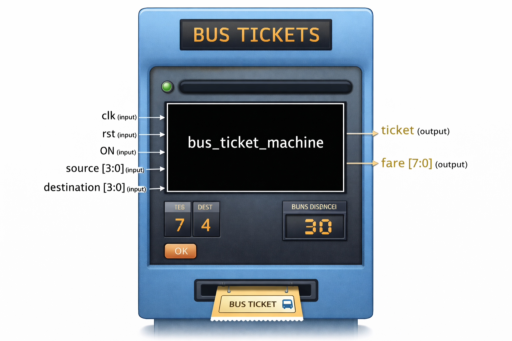

# Bus Ticket Machine (Verilog)
## Overview

Implements a simple bus ticket vending machine in Verilog HDL.

Computes the fare based on selected source and destination stops.

Generates a ticket signal when fare calculation is complete.

Fully synchronous design with clock (clk) and reset (rst).

Demonstrates finite state machine (FSM) design for sequential logic.

## Inputs and Outputs

### Inputs:

clk – Clock signal

rst – Active-high reset

ON – Machine activation signal

source [3:0] – Source stop number (0–15)

destination [3:0] – Destination stop number (0–15)

### Outputs:

ticket – Signal indicating ticket is issued (1 when done)

fare [7:0] – Calculated fare in units (10 units per stop difference)

## Design Details

Uses a finite state machine (FSM) with 5 states:

start – Wait for machine activation

sel_source – Capture source stop input

sel_destination – Capture destination stop input

price – Calculate fare based on distance

done – Issue ticket

Fare calculation formula:

fare = abs(destination - source) * 10;

The ticket is printed only after the fare has been calculated and the FSM is in the initial position.

## Block Diagram

## Learning Outcomes

Understanding FSM-based control in Verilog.

Practice with combinational and sequential logic.

Simple arithmetic operation in hardware (fare calculation).

Multi-output control system in HDL.
